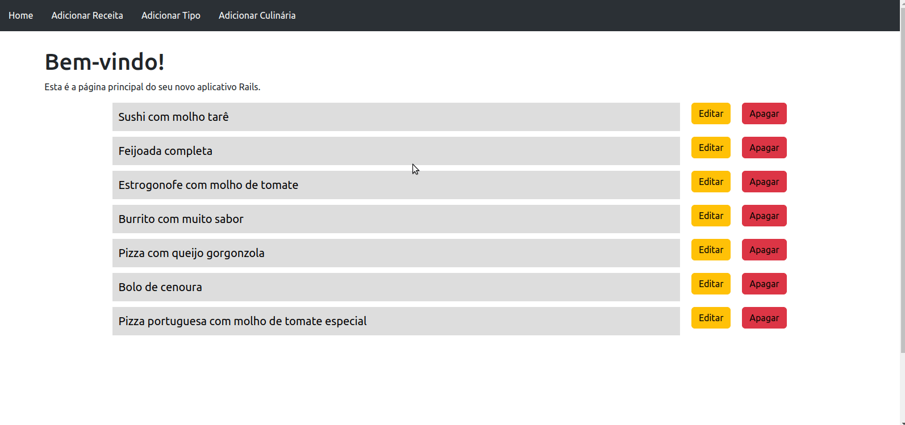

# About the project / *Sobre o projeto*

This project is a recipes book (basic CRUD - create, read, update, delete), where the user is able to register the type of recipe (meals, desserts, snacks, etc), register the cuisine (Brazilian, Japanese, German , etc), add and view the complete recipes with the information provided. The application was developed in Ruby on Rails, using the Bootstrap framework for the front-end.

*Esse projeto é um livro de receitas (CRUD básico - create, read, update, delete), onde o usuário é capaz de cadastrar o tipo da receita (refeições, sobremesas, lanches, etc), cadastrar a culinária (brasileira, japonesa, alemã, etc), adicionar e visualizar as receitas completas com as informações fornecidas. A aplicação foi desenvolvida em Ruby on Rails, utilizando o framework Bootstrap para o front-end.*

---
# Layout



---
# Installation / *Instalação*

  1. Clone the respository / *Clone o repositório*
  ```bash
  git clone git@github.com:kelsonbatista/recipes-book-ruby-on-rails.git
  ```
  2. Install dependencies / *Instale as dependências*
  ```bash
  bundle install
  ```
  3. Run migrations / *Execute as migrações*
  ```bash
  rails db:migrate
  ```
  4. Run seeds / *Execute os seeds*
  ```bash
  rails db:seed
  ```
  5. Initialize server / *Inicie o servidor*
  ```bash
  rails s
  ```
  6. Access the system / *Acesse o sistema*
  ```bash
  http://localhost:3000
  ```
---
